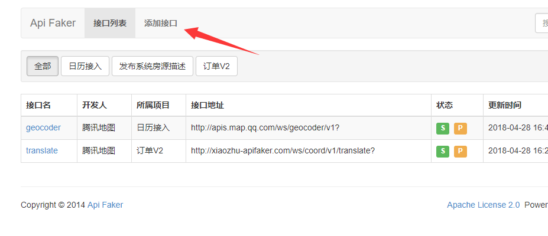
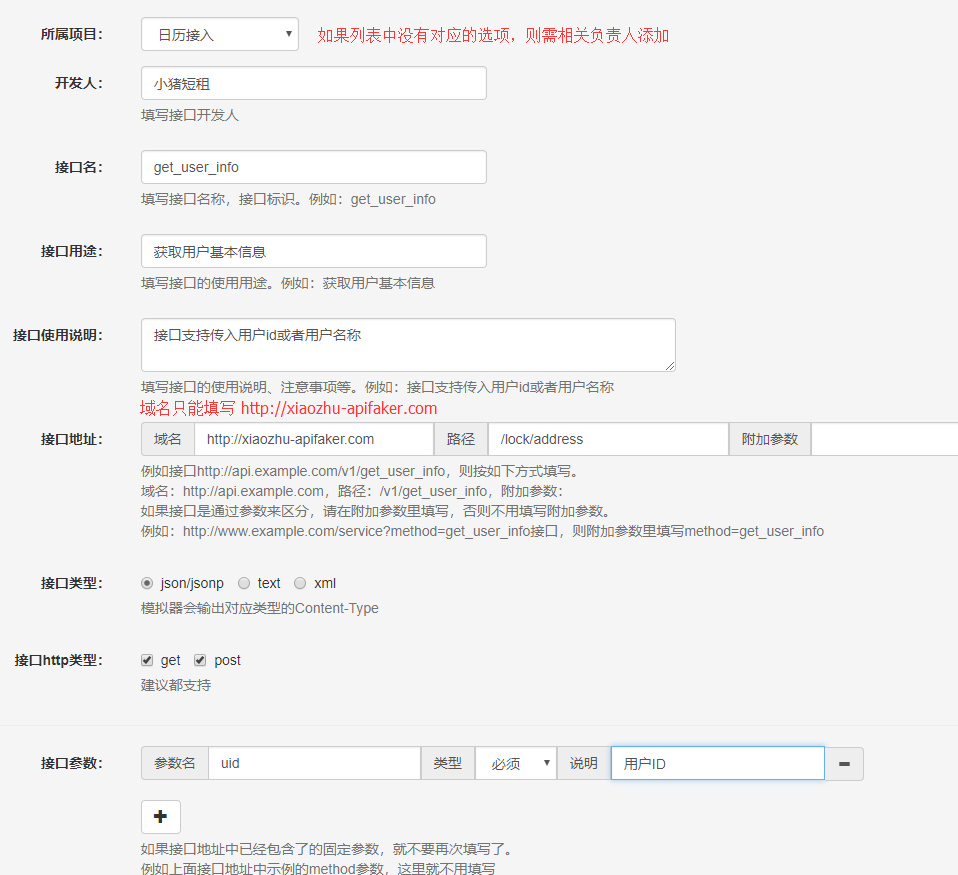
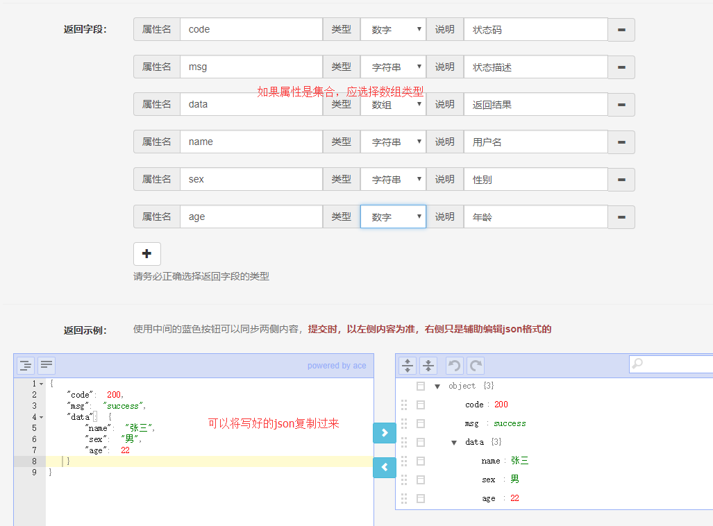
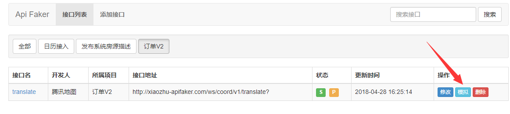
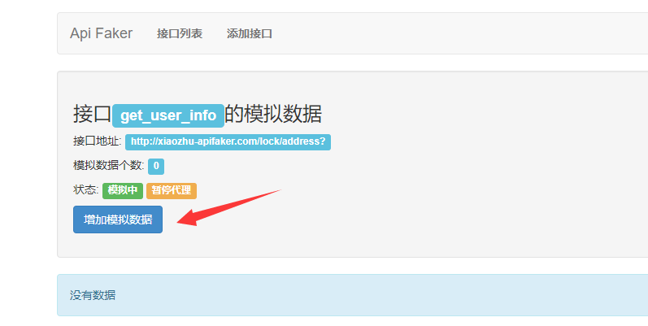
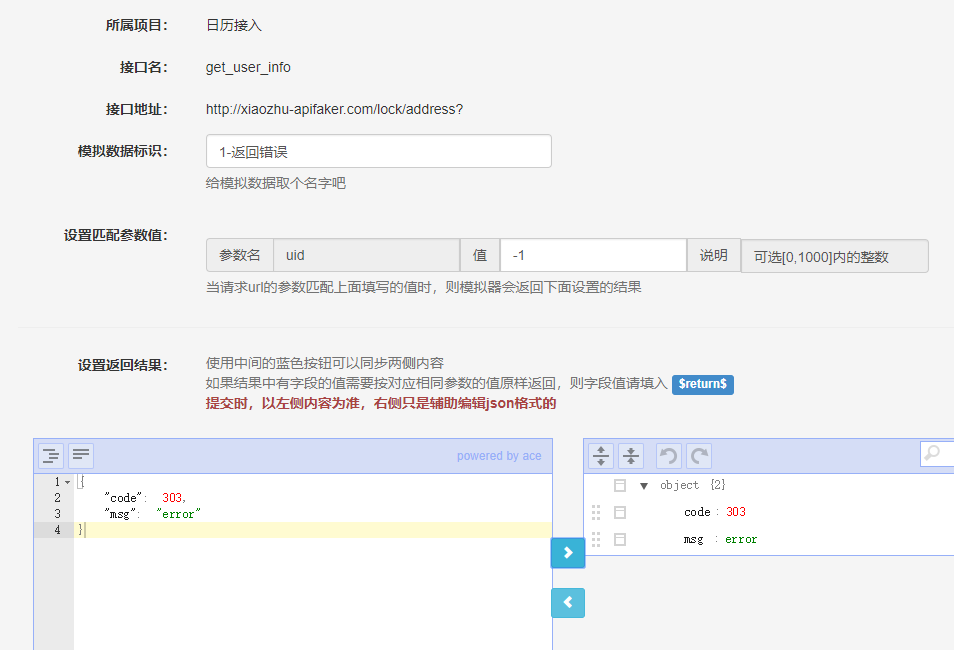
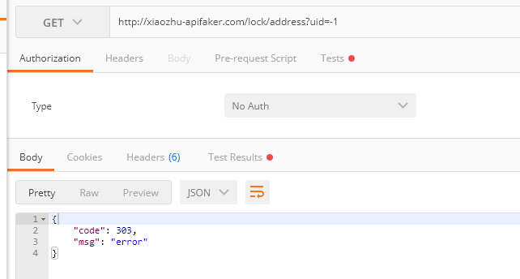

## ApiFaker使用说明

ApiFaker一个模拟器，它可以模拟api行为返回json(jsonp)，text或xml格式数据。

Api管理平台支持浏览器: Chrome, Firefox, Safari, Opera, Internet Explorer 9+.

* #### 连接Wifi
wifi 名为 `xiaozeze`
密码 `xiaozeinxiaozhu`

* #### 修改本地hosts
将以下对应关系添加到本地host文件中
```
192.168.1.101 xxx-apifaker.com
```
`Windows` 环境下hosts文件位于`C:\Windows\System32\drivers\etc\` 目录下

`MacOS`环境下

* #### 管理Api

在浏览器中打开
[`http://xiaozhu-apifaker.com/manage`](http://xxx-apifaker.com/manage)


* #### 添加接口




* #### 填写接口相关信息




* #### 定义返回格式



* #### 勾选请求模拟并且提交


* #### 设置请求模拟


* #### 添加模拟数据


* #### 添加模拟返回数据


* #### 请求示例

